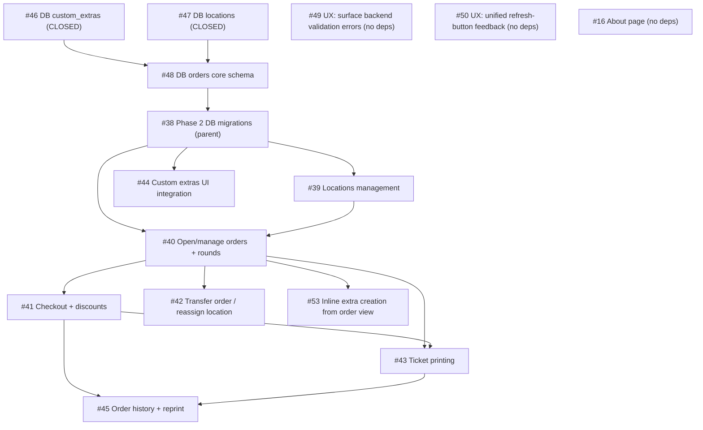

# Phase 2 Issues Dependency Tree

> Snapshot as of 2026-07-05. Regenerate from `gh issue list` when issues close or new ones are filed.

## Suggested resolution order

1. **#48** — DB orders schema (deps #46/#47 already closed, ready now)
2. **#38** — closes once #48 lands (parent checklist)
3. **#39** — Locations availability (needs #38)
4. **#40** — Core order/round flow (needs #38 + #39) — biggest unlock, most other issues wait on this
5. Parallel after #40: **#41** (checkout), **#42** (transfer), **#44** (extras UI), **#53** (inline extra)
6. **#43** — Ticket printing (needs #40 + #41)
7. **#45** — History + reprint (needs #41 + #43) — last in the Phase 2 chain

**Standalone, no dependencies:** #49, #50, #16 — can be done anytime, good filler between phases.
